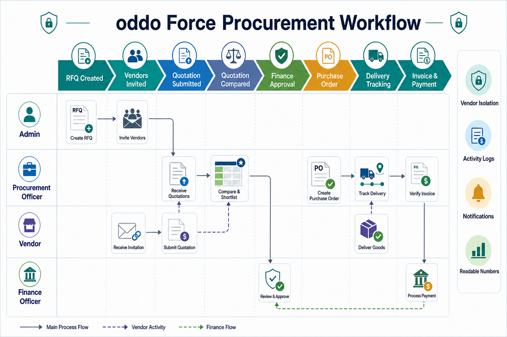
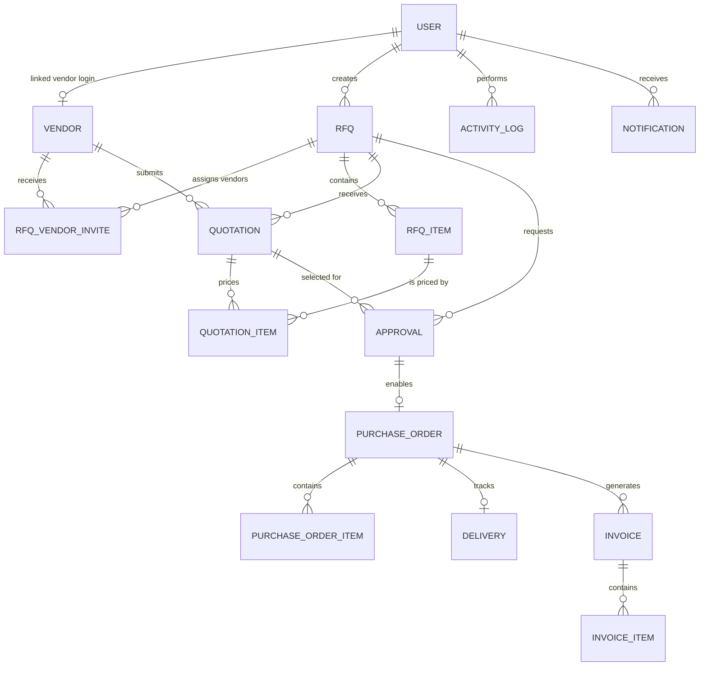

# VendorBridge Project Flowchart

This flowchart explains how VendorBridge moves a procurement request from RFQ creation to invoice payment while preserving role-based access, vendor isolation, activity logs, and notifications.

## End-to-End Procurement Workflow

```mermaid
flowchart LR
  start([User signs in])
  auth{Role-based access}

  start --> auth

  auth --> admin["Admin workspace<br/>Manage users, vendor categories, and vendors"]
  auth --> procurement["Procurement Officer workspace"]
  auth --> finance["Finance Officer workspace"]
  auth --> vendor["Vendor workspace<br/>Only assigned vendor records"]

  admin --> vendorMaster["Vendor master data<br/>Vendor profile, category, rating, login"]
  vendorMaster --> vendor

  procurement --> rfqDraft["Create RFQ draft<br/>RFQ-YYYY-NNNN"]
  rfqDraft --> rfqItems["Add RFQ items<br/>Quantity, unit, specifications"]
  rfqItems --> inviteVendors["Assign invited vendors"]
  inviteVendors --> sendRfq{"Send RFQ?"}
  sendRfq -- "No vendors or expired deadline" --> rfqBlocked["Validation stops send"]
  sendRfq -- "Valid" --> rfqSent["RFQ status: SENT"]

  rfqSent --> notifyVendors["Notify assigned vendors"]
  notifyVendors --> vendorView["Vendor views assigned RFQ only"]
  vendorView --> quoteGate{"Can submit quotation?"}
  quoteGate -- "Not invited, expired, duplicate, or incomplete pricing" --> quoteRejected["Submission rejected"]
  quoteGate -- "Valid" --> quotation["Submit quotation<br/>QUO-YYYY-NNNN"]

  quotation --> quoteRules["System calculates totals<br/>Every RFQ item must be priced"]
  quoteRules --> quoteReceived["RFQ status: QUOTATIONS_RECEIVED"]
  quoteReceived --> notifyProcurement["Notify procurement requester"]

  procurement --> compare["Compare quotations<br/>Price, delivery timeline, vendor rating"]
  notifyProcurement --> compare
  compare --> recommend["Recommend selected quotation"]
  recommend --> approvalPending["Create finance approval<br/>RFQ status: APPROVAL_PENDING"]
  approvalPending --> notifyFinance["Notify Finance Officers"]

  notifyFinance --> financeReview{"Finance decision"}
  financeReview -- "Reject" --> rejected["Approval: REJECTED<br/>RFQ status: REJECTED"]
  financeReview -- "Request revision" --> revision["Approval: REVISION_REQUESTED<br/>RFQ status: UNDER_REVIEW"]
  revision --> compare
  financeReview -- "Approve" --> approved["Approval: APPROVED<br/>RFQ status: APPROVED"]

  approved --> poGate{"Generate PO?"}
  poGate -- "No approved approval record" --> poBlocked["PO generation blocked"]
  poGate -- "Approved" --> purchaseOrder["Generate purchase order<br/>PO-YYYY-NNNN"]
  purchaseOrder --> poTotals["PO totals copied from approved quotation"]
  poTotals --> poStatus["RFQ status: PO_GENERATED<br/>PO status: GENERATED"]
  poStatus --> notifyVendorPo["Notify selected vendor"]

  notifyVendorPo --> delivery["Delivery tracking"]
  delivery --> vendorUpdates["Vendor updates<br/>ACKNOWLEDGED -> READY -> DISPATCHED -> DELIVERED"]
  delivery --> internalUpdates["Internal updates<br/>SENT_TO_VENDOR, COMPLETED, CANCELLED"]

  poStatus --> invoiceGate{"Generate invoice?"}
  invoiceGate -- "No purchase order" --> invoiceBlocked["Invoice generation blocked"]
  invoiceGate -- "PO exists" --> invoice["Generate invoice<br/>INV-YYYY-NNNN"]
  invoice --> invoiceTotals["Invoice totals copied from purchase order"]
  invoiceTotals --> payment["Finance updates payment status<br/>UNPAID, PARTIALLY_PAID, PAID, OVERDUE"]

  rfqDraft -. "Activity log" .-> audit[(Activity logs)]
  rfqSent -. "Activity log" .-> audit
  quotation -. "Activity log" .-> audit
  approvalPending -. "Activity log" .-> audit
  approved -. "Activity log" .-> audit
  purchaseOrder -. "Activity log" .-> audit
  delivery -. "Activity log" .-> audit
  invoice -. "Activity log" .-> audit

  notifyVendors -.-> notifications[(Notifications)]
  notifyProcurement -.-> notifications
  notifyFinance -.-> notifications
  notifyVendorPo -.-> notifications
```

## What Judges Should Notice

- **Clear ownership boundaries:** Admin manages users and vendors; Procurement owns RFQs, comparison, recommendations, purchase orders, and invoices; Finance owns approval and payment decisions; Vendors see only their assigned RFQs and their own records.
- **Controlled state transitions:** The workflow moves through explicit statuses such as `DRAFT`, `SENT`, `QUOTATIONS_RECEIVED`, `APPROVAL_PENDING`, `APPROVED`, `PO_GENERATED`, and delivery/payment states.
- **Vendor isolation:** Vendor-facing queries are filtered by the authenticated user's linked `vendorId`, so vendors cannot inspect competing quotations or unrelated documents.
- **Financial safeguards:** Purchase orders require an approved finance approval record, and invoice totals are derived from the generated purchase order.
- **Auditability:** Major workflow actions create activity logs, and important transitions create notifications for the affected users.
- **Readable business numbers:** Core documents use operator-friendly numbers: `RFQ-YYYY-NNNN`, `QUO-YYYY-NNNN`, `PO-YYYY-NNNN`, and `INV-YYYY-NNNN`.

## Simplified Role Matrix

| Role | Primary responsibilities | Important restrictions |
| --- | --- | --- |
| Admin | Manage users, vendors, categories, and master data | Does not replace finance approval in the procurement flow |
| Procurement Officer | Create/send RFQs, compare quotations, recommend vendors, generate POs and invoices | Cannot approve finance requests or update payment status |
| Finance Officer | Review approvals, approve/reject/revision procurement requests, update invoice payment status, view finance reports | Cannot submit vendor quotations or generate POs |
| Vendor | View assigned RFQs, submit one quotation per RFQ, track own POs, deliveries, invoices, and notifications | Cannot view competing quotations or organization-wide internal reports |

## Data Model Backbone

## Implementation References

| Area | Main files |
| --- | --- |
| API routing and role guards | `backend/src/routes/index.js` |
| RFQ creation, vendor assignment, and RFQ sending | `backend/src/controllers/rfq.controller.js` |
| Quotation, comparison, approval, PO, delivery, and invoice workflow | `backend/src/controllers/workflow.controller.js` |
| Database entities and status enums | `backend/prisma/schema.prisma` |
| Activity logs, notifications, and document numbering | `backend/src/services/` |
| Role-based screens and user actions | `frontend/src/App.jsx` |
