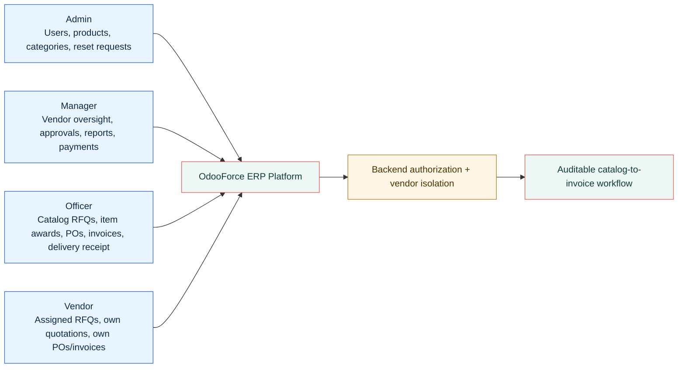
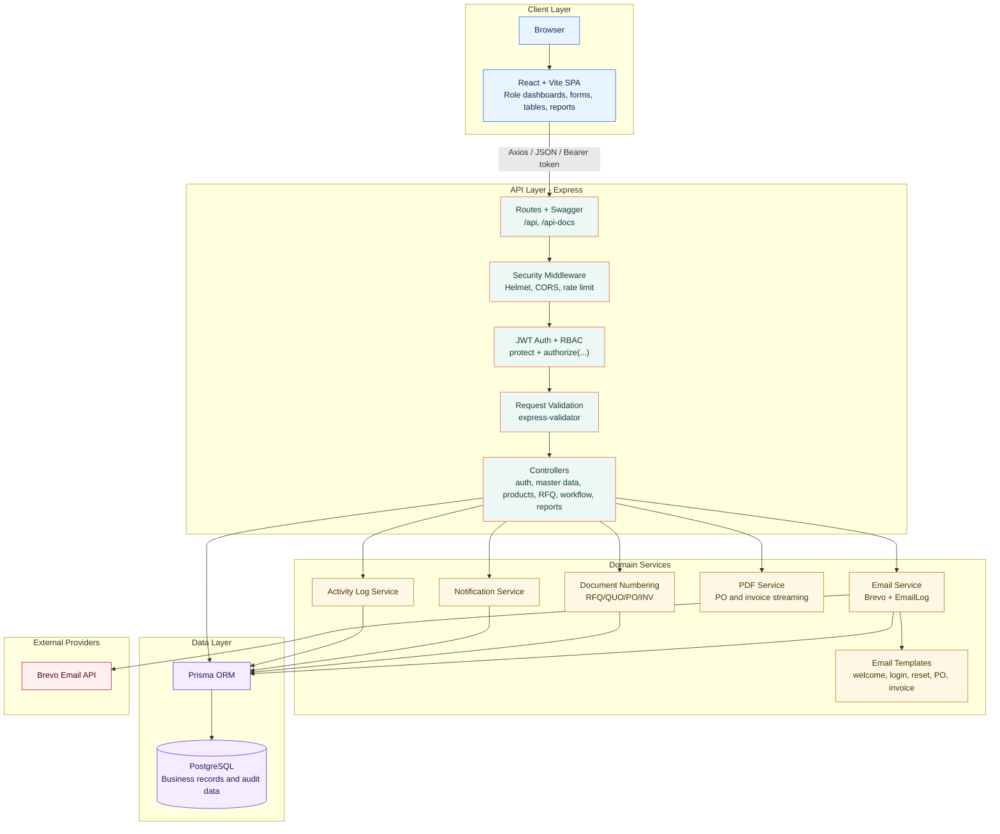
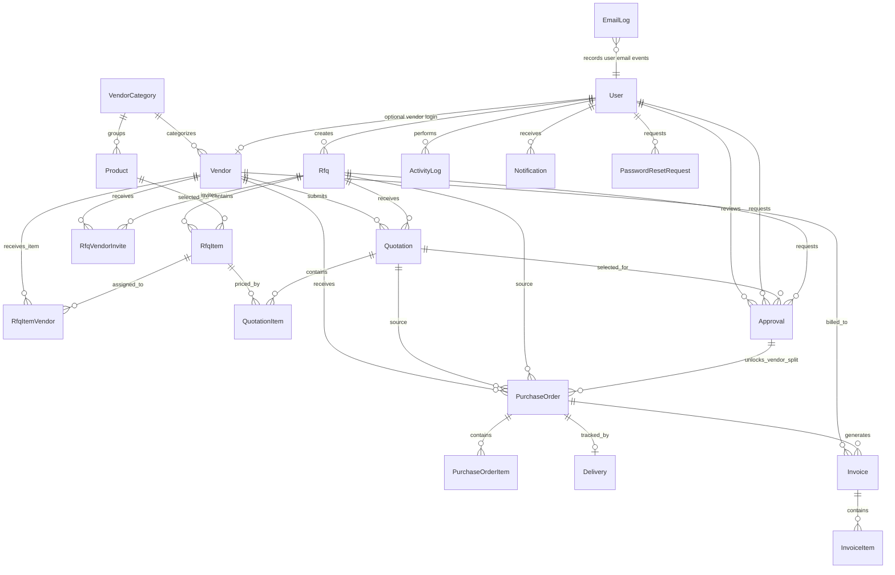
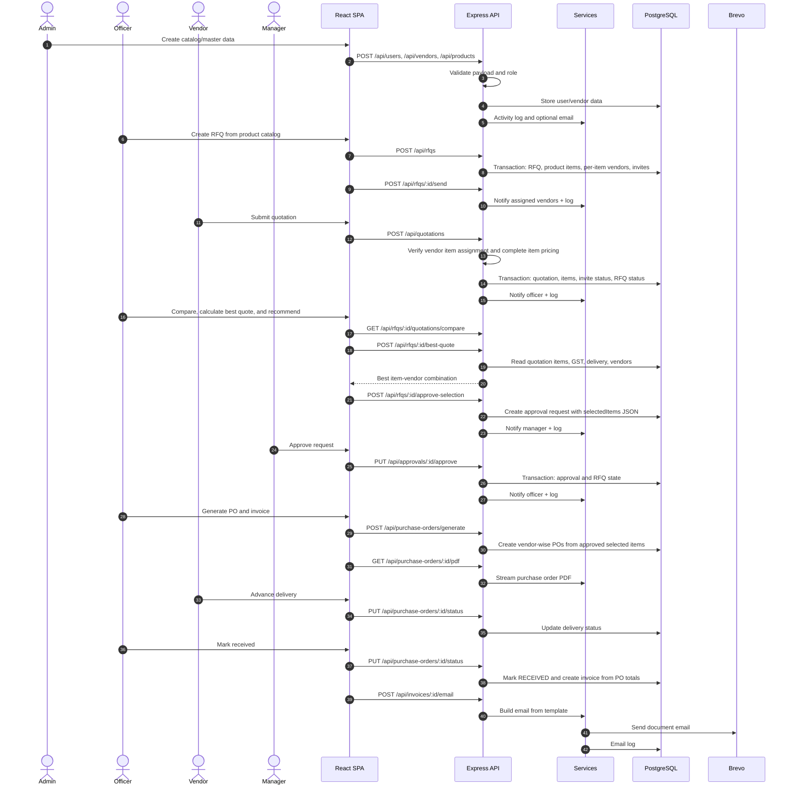
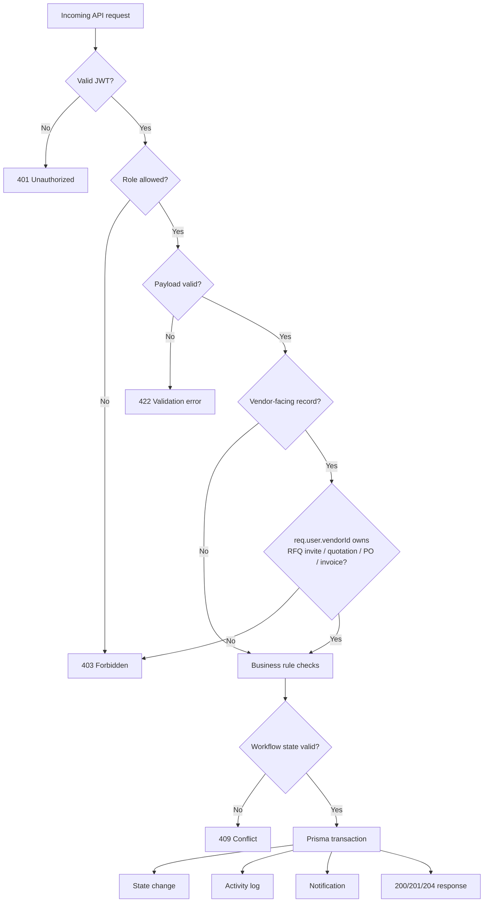

# odooForce Technical Diagrams

Professional technical views for the current main branch of the OdooForce procurement ERP.

Open [TECHNICAL_DIAGRAMS.html](TECHNICAL_DIAGRAMS.html) in a browser for a presentation-ready visual version.

## 1. Four-User Role Model

## 2. System Architecture

## 3. Procurement Workflow and Control Points

```mermaid
flowchart LR
  Admin(["Admin"]) --> Users["Users, products, categories<br/>Password reset requests"]
  Manager(["Manager"]) --> VendorMaster["Vendor oversight<br/>Reports + payments"]
  Officer(["Officer"]) --> Draft["Create RFQ from products<br/>Quantity + per-item vendors"]

  Draft --> SendGate{"Valid RFQ?<br/>Active products + quantity + item vendors"}
  SendGate -->|No| ValidationError["422 validation error"]
  SendGate -->|Yes| Sent["Send RFQ<br/>Notify vendors for assigned items"]

  Vendor(["Vendor"]) --> Assigned{"RFQ assigned<br/>to vendorId?"}
  Sent --> Assigned
  Assigned -->|No| Forbidden["403 forbidden"]
  Assigned -->|Yes| Quote["Submit quotation<br/>Every item priced"]
  Quote --> QuoteGate{"Items assigned<br/>and workflow not locked?"}
  QuoteGate -->|No| Conflict["409 workflow conflict"]
  QuoteGate -->|Yes| Received["Quotation stored<br/>Unique RFQ + vendor"]

  Received --> Compare["Officer compares per-item quotes<br/>Price + GST + delivery"]
  Compare --> Best["Best-quote combination<br/>Cheapest valid vendor per item"]
  Best --> Select["Officer submits selected items"]
  Select --> Approval["Manager approval request"]
  Approval --> Decision{"Manager decision"}
  Decision -->|Rejected| Rejected["Rejected or revision required"]
  Decision -->|Approved| Approved["Approved"]
  Approved --> PO["Officer generates vendor-wise POs<br/>Totals from selected items"]
  PO --> Delivery["Delivery status tracking<br/>Pending to received"]
  Delivery --> Invoice["Invoice from PO<br/>Auto-generated on receipt"]
  Invoice --> Payment["Manager tracks payment status"]

  Users -.-> Audit["Activity logs"]
  VendorMaster -.-> Audit
  Sent -.-> Audit
  Quote -.-> Audit
  Select -.-> Audit
  Decision -.-> Audit
  PO -.-> Audit
  Invoice -.-> Audit
  Sent -.-> Notices["Notifications"]
  Quote -.-> Notices
  Approval -.-> Notices
  Decision -.-> Notices

  classDef actor fill:#e8f4ff,stroke:#2563eb
  classDef step fill:#edf7f4,stroke:#e85a4f
  classDef gate fill:#fff7e6,stroke:#b7791f
  classDef fail fill:#fff1f2,stroke:#be123c
  classDef audit fill:#f3edff,stroke:#6d28d9
  class Admin,Manager,Officer,Vendor actor
  class Users,VendorMaster,Draft,Sent,Quote,Received,Compare,Best,Select,Approval,Rejected,Approved,PO,Delivery,Invoice,Payment step
  class SendGate,Assigned,QuoteGate,Decision gate
  class ValidationError,Forbidden,Conflict fail
  class Audit,Notices audit
```

## 4. Data Model

## 5. API Sequence - RFQ to Invoice

## 6. Security, Validation, and Isolation Model

## 7. Feature Surface

| Area | Main branch capability |
| --- | --- |
| Authentication | Login, logout, current user, public vendor signup, forgot password, reset password |
| User management | Create/update internal users, password update, status update, soft deactivation, reset request review |
| Product catalog | Products with category, unit, default GST, active/inactive status |
| Vendor management | Categories with default GST, vendor profiles, rating, status, GST, optional login creation |
| RFQs | Create from catalog products, assign vendors per item, send, list visible RFQs |
| Quotations | Vendor submission for assigned items, GST-aware pricing, delivery days, ranked comparison |
| Best quote | Cheapest valid item-vendor combination and manual override before approval |
| Approvals | Approval queue, selectedItems review, approve, reject, revision request |
| Purchase orders | Generate vendor-wise POs from approved selected items, status updates, PDF, email |
| Deliveries | Delivery lifecycle from PENDING to RECEIVED, with invoice creation on receipt |
| Invoices | Generate from PO, payment status update, PDF, email |
| Reporting | Dashboard summary, monthly spend, vendor performance, RFQ summary, pending approvals, CSV export |
| Auditability | Activity logs, notifications, email logs |

## 8. Four-User Access Matrix

| Capability | Admin | Manager | Officer | Vendor |
| --- | --- | --- | --- | --- |
| Manage internal users and access | Yes | Limited oversight | No | Password reset request |
| Manage product catalog | Yes | Review | Read | No |
| Manage vendors and categories | Yes | Yes | Read vendors | No |
| Create, edit, and send catalog RFQs | No | Review | Yes | No |
| View RFQs | All | All | Operational RFQs | Assigned only |
| Submit quotations | No | No | No | Own assigned RFQs only |
| See competing vendor quotations | Yes | Yes | Yes | No |
| Recommend selected item-vendor combination | No | Review | Yes | No |
| Approve or reject approval request | No | Yes | No | No |
| Generate vendor-wise purchase orders | No | Review | Yes | No |
| Update delivery status | Oversight | Oversight | Internal statuses | Own delivery progress |
| Generate invoices | No | Review | Yes | No |
| Update payment status | No | Yes | No | No |
| View reports and exports | Yes | Yes | Limited operational views | No |
| View own notifications/documents | Yes | Yes | Yes | Own records only |
